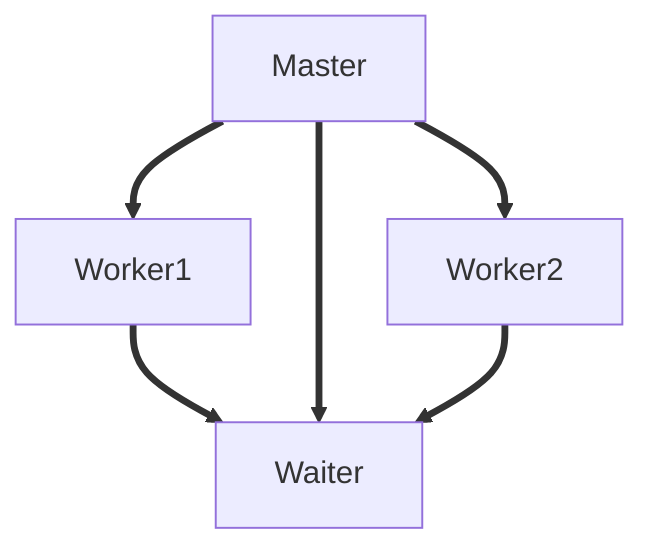

# Mediahub

A  server software for transport live media and HTTP resources.

## 1. 模块化设计

```mermaid
graph TD;
Master==>Worker1;
Master==>Worker2;
Worker1==>Waiter;
Master==>Waiter;
Worker2==>Waiter;
```
